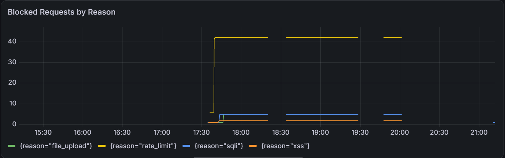
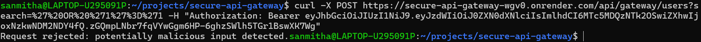
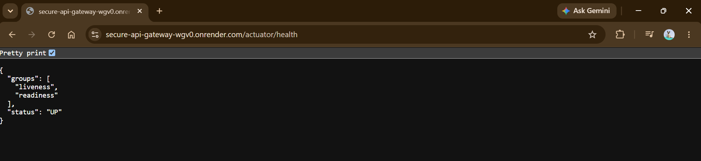

# Secure API Gateway

A Spring Boot API gateway that centralizes authentication, request
sanitization, rate limiting, and observability in front of backend
services - so individual services don't need to reimplement these
checks themselves.

**Live demo:** https://secure-api-gateway-wgv0.onrender.com/
*(free-tier hosting - the service spins down after 15 min of
inactivity and takes ~1 min to wake on the first request)*

## Why this project

Built to demonstrate, as a standalone and fully testable project, the
same "centralize the security check once, apply it everywhere"
pattern used in production systems that harden many REST endpoints at
once - rather than patching each endpoint individually.

## Features

- **JWT authentication** at the gateway edge - a single filter
  establishes identity before any request reaches business logic
- **Input sanitization** - SQL Injection and XSS detection via
  canonicalization (closes common encoding-bypass tricks) and
  structural pattern matching, deliberately avoiding naive keyword
  blacklisting to reduce false positives on legitimate input
- **Malicious file upload validation** - verifies actual file content
  via Apache Tika (magic-byte detection), not just filename/
  Content-Type headers, which are trivially spoofable
- **Redis-backed rate limiting** - fixed-window, per-user (falls back
  to per-IP for unauthenticated requests), correct across multiple
  gateway instances since state lives in Redis, not memory
- **Prometheus metrics** - custom counters tracking blocked requests
  by reason (`sqli`, `xss`, `rate_limit`, `file_upload`), visualized
  in a Grafana dashboard
- **Fully containerized** - one `docker compose up` starts the
  gateway, Redis, Prometheus, and Grafana together

## Architecture

Client → [Input Sanitization Filter] → [JWT Auth Filter] → [Rate Limit Filter] → Controller → (proxies to) → Downstream Service


Each filter is a single, centralized checkpoint — the pattern this
project is built around, rather than repeating checks per endpoint.

## Tech stack

Java 25 · Spring Boot 4.1 · Spring Security 7 · Redis (Lettuce) ·
Apache Tika · Micrometer/Prometheus · Docker Compose · JUnit 5 /
AssertJ

## Running locally

**Requires:** JDK 25, Docker & Docker Compose

```bash
export JWT_SECRET="<a real 256-bit base64 secret — generate via: openssl rand -base64 32>"
docker compose up --build
```

This starts:
- Gateway → `http://localhost:8080`
- Prometheus → `http://localhost:9090`
- Grafana → `http://localhost:3000` (login: `admin` / `admin`)

### Try it out

```bash
# Get a token (no login endpoint yet - generate one via the test):
./mvnw test -Dtest=JwtUtilTest

# Call a protected route:
curl http://localhost:8080/api/gateway/users \
  -H "Authorization: Bearer <token from above>"

# Try without a token — should 403:
curl http://localhost:8080/api/gateway/users

# Trigger a blocked request:
curl "http://localhost:8080/api/gateway/users?search=%27%20OR%20%271%27%3D%271" \
  -H "Authorization: Bearer <token>"
```
## Screenshots

**Grafana dashboard — blocked requests by reason:**


**A SQL injection attempt blocked on the live deployment:**


**Live health check:**


## Known limitations (deliberate, documented trade-offs)

- **SQLi/XSS detection is defense-in-depth, not the real fix.** The
  actual defense against SQL injection is parameterized queries at
  the database layer, which this demo gateway doesn't have (no real
  DB layer exists behind the mock downstream service). The filters
  here catch known attack *shapes* via narrow, structural regex —
  deliberately avoiding single-keyword blacklisting, which produces
  false positives on legitimate text (e.g. rejecting `O'Brien` for
  containing an apostrophe).
- **No login endpoint yet** - tokens are currently generated via a
  unit test rather than a real `/api/auth/login` flow.
- **Prometheus/Grafana are not hosted alongside the live Render
  deployment** - Render's free tier only covers web services, not
  the private-service tier these would need. They run locally and
  can be pointed at either the local container or the live URL.
- **Rate limiting uses a fixed-window counter**, not a token bucket -
  simpler to reason about, with a known trade-off (a burst right at
  a window boundary can allow up to 2x the limit briefly).

## What I'd improve at scale

- A real login endpoint backed by a persistent user store, not a
  hardcoded demo user
- Move from fixed-window to a sliding-window or token-bucket rate
  limiter to close the window-boundary burst issue
- Split the downstream mock service into an actually separate
  deployment, to prove the gateway pattern across a real network
  boundary rather than same-process routing
- Key rotation support (multiple valid signing keys via a `kid`
  claim), rather than a single static JWT secret
- A hosted, always-on observability stack instead of local-only
  Grafana

## License

MIT